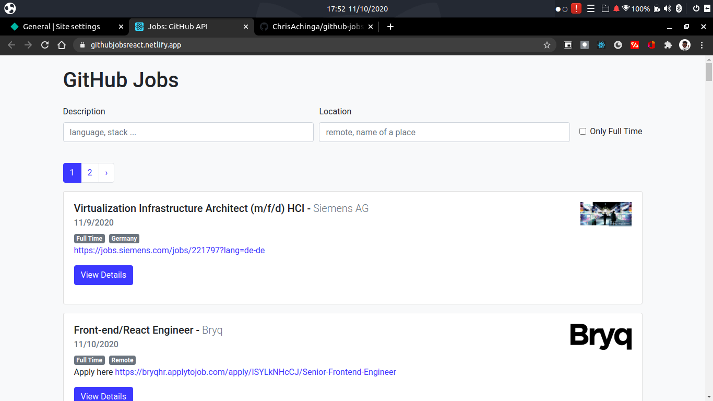

# Developer Jobs: GitHub Jobs API

<!-- 

- [tutorial code](https://github.com/WebDevSimplified/GitHub-Jobs-API-React-App)  
- [video tutorial](https://www.youtube.com/watch?v=fxY1q4SCB64&t=4s)

 -->

## About the Project

Displays list of jobs using the GitHub jobs API.

One can filter/search by job description/location and by time.